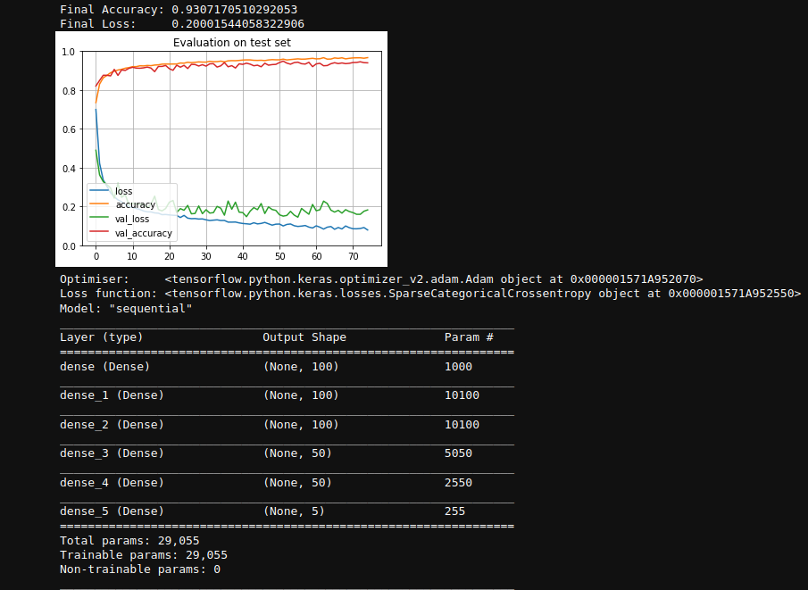

# Deep learning basics

Exploring deep learning and associated concepts by training a model to predict a house's proximity to the ocean in California.

Complete with comparisons of networks using different depths, densities, learning rates, activation functions, optimizers, and more.

Submitted as coursework in my second year at the University of Bath.

See the [notebook](./Practical5.ipynb) for details.

## Summary

### Batch size
Out of the 4 batch sizes tested (50, 100, 200, 400), the lowest is consistently getting higher accuracy and lower loss values. This is expected since a smaller number of values are passed through the network each time, meaning it backpropagates more times for a fixed data set. While this is good, it comes with the trade off of run speed. It took significantly longer to run each network with smaller batch sizes.

### Learning rate
You may have noticed I am using default learning rates, this is because in my preliminary tests I found it very hard to find good learning rates. This lead me to instead use default values, which have been proven to work well with their respective optimizers.

### Dropout
Using dropout layers seems to reduce train accuracy for the shallow network, but increase it for the deeper network.

Dropout is designed to reduce overfitting in DNNs by reducing the importance of any given neuron. Given this, it makes sense for a shallow network to perform worse with dropout layers, or even deep networks if dropout is used in the first couple of layers. This is because even fairly basic features are being dropped, hence making it perform worse.

Dropout doesn't affect the DNN that much, indicating there isn't any significant overfitting.

### Number of Hidden Layers & Hidden layer width
In general, adding more hidden layers increases accuracy and lowers loss. The network is able to draw more complex relationships with more hidden layers. With this extra information, it is able to more accurately make classifications in the dataset.

### Activation Functions
In my preliminary research, one of the things I tried was different activation functions, e.g. elu, sigmoid, but universally it made the results worse. I believe this is for various reasons, mainly because the dataset is relatively small compared with real world data sets.

## Final model
Using the results and justifications above, I have configured a network to be evaluated against the test set.

### Final model analysis
It performed similarly on the train and test sets, telling me that there was minimal overfitting, and it performed very well (93% accuracy vs 20% if it were guessing randomly) telling me there is little to no underfitting.
